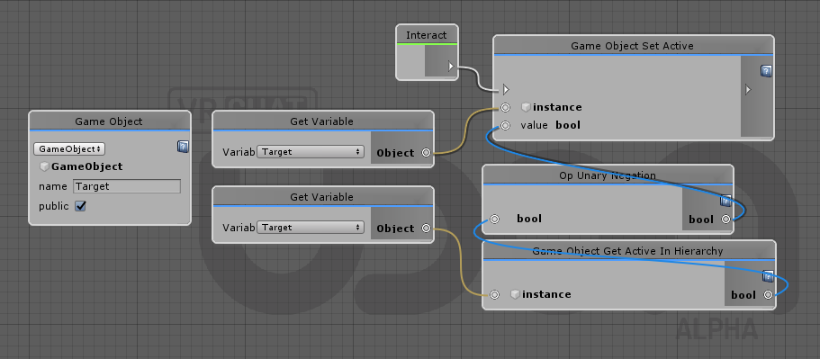
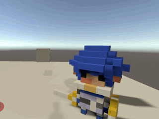

# Al interactual activar/desactivar un objeto

## INTERACT

<details><summary>Code</summary>
```
AOVW0U7bMBT9lcrPcWXHjp1U4mEbjFWT2CSgLxOqbOe6yxYclDhsVeHLeNgn7Rfm0lJBAyhiq4Q0JQ+2k9jnnnvuufl982uBLlXZAhp9WSDbluWROg8TdHAJzk/HzkOtjEcRaos8LHORJjLnGaaSAOaSU5wqorEGkyWGqdzkNLx8UTWFLyqHRgv0E414OiQRmqMRjqkYkusIuSqH0/F+E449i5Atqx/rGaIZz2IDFItMW8zzLMNhAFgxLZXRSZbnFp2tdpgskd/ucR09QH/qCj8/cLPCwWFY+aS/gfHD6fQY/Bvji0sIw3nj4fxtVZWg3N10UoUo72LthaQTK03EJljCt4NF2sYsSzRgoFphzi3HyhCGDTWpIRmz2vArErYVCWXWUoVZQpLAtGbhdG6xYExlTOecQBJefMjeNi8L1C6ZWMU/WeV5gQrXeOUMjPfRaImv8XXhZuvHCC25fMln20k4BD+dqLpQuoQNqX3i75KK77FKY9JhdQc0rAQxPL5djAbnjanqstDRYAJ1E5Dthdwur2jwri19W8Oeg9bXqowGn1tdFuYjzE+q7+D2tJQqMYmgGeNA0uzKMB6DSjk21i45SDVOgdkQGZcSQEpmSZfOOyqnj4p7Q3CvzbsEM0GeJTi6d78aze0wRyeqnoH/O1xrc/nHwOpwxOuD9V6VzUtxdbX+lH+HlEzVrYGP3YcitKbafJ1vefmmElJpgWgRelWiQiVISbCOOcFJnNM4D84uxGP+zfm6EOKuewvBVWwyg5VlOeYkVJjWwcekEjlhlFIC6Y5MuZe79sH3vLuyTn/+L8z1gYKC0KqLYLOqnh/BTC2ZeuJ/YVtyfZr2c5LDomu9fWS8M82dXf8B
```
</details>



## DEMO


